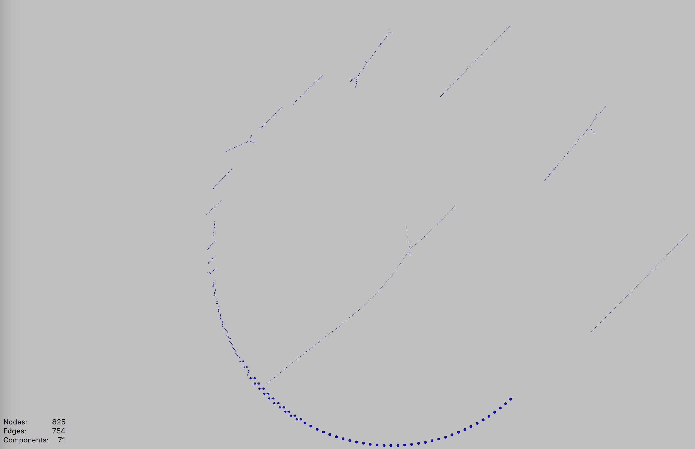

# solana-block-graph

Fetches Solana block data from RPC, generates a simplified conflict graph of the transactions.
Output is a json file which can be opened with external software such as Graphia.

Transaction graph is ordered by the inclusion order of the transactions in the block, not their priority.
